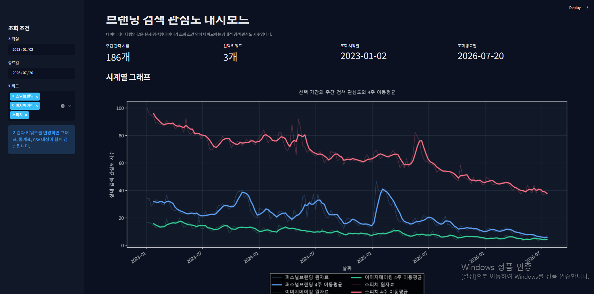
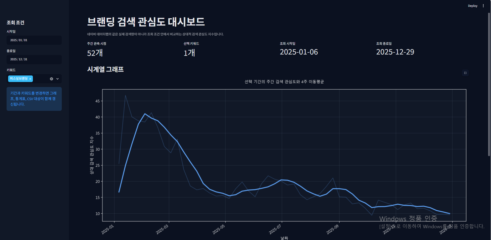

# 브랜딩 관련 검색 관심도 시계열 분석

## 프로젝트 목적

네이버 데이터랩 검색어 트렌드를 이용해 브랜딩 관련 세 키워드의 주간 검색 관심도 변화를 분석한 프로젝트입니다.

단순히 그래프를 만드는 데 그치지 않고 장기 흐름, 큰 변화가 발생한 시점, 반복되는 월별 패턴을 확인하여 브랜딩 콘텐츠의 주제와 제작 시점을 데이터에 근거해 판단하는 것을 목적으로 합니다.

## 분석 데이터

- 출처: 네이버 데이터랩 검색어 트렌드
- 분석 키워드: 퍼스널브랜딩, 이미지메이킹, 스피치
- 분석 기간: 2023-01-02 ~ 2026-07-20
- 데이터 주기: 주간
- 데이터 크기: 키워드별 186개 시점
- 원본 파일: [`data/datalab.xlsx`](data/datalab.xlsx)

## 프로젝트 폴더 구조

```text
branding-trend-analysis/
├── .streamlit/
│   └── config.toml
├── data/
│   └── datalab.xlsx
├── images/
│   ├── dashboard/
│   │   ├── 01_dashboard_overview.png
│   │   └── 02_dashboard_filtered.png
│   ├── 01_weekly_trend.png
│   ├── 02_weekly_change.png
│   ├── 03_monthly_pattern.png
│   └── 04_speech_decomposition.png
├── tests/
│   └── test_dashboard_data.py
├── .gitignore
├── analysis.ipynb
├── app.py
├── dashboard_data.py
├── REPORT.md
├── README.md
└── requirements.txt
```

## 분석 방법 요약

### 4주 이동평균

현재 주와 직전 3주의 평균을 계산하여 주간 변동을 완화하고 약 한 달 단위의 흐름을 확인합니다.

### 전주 대비 증감량

이번 주 관심도에서 이전 주 관심도를 빼서 지표가 실제로 얼마나 증가하거나 감소했는지 확인합니다.

### 전주 대비 변화율

전주 대비 증감량을 이전 주 관심도로 나누어 변화 속도를 백분율로 확인합니다. 이전 값이 작으면 변화율이 과장될 수 있으므로 증감량과 함께 해석합니다.

### 월별 평균 분석

연도와 월별로 주간 관심도의 평균을 계산해 반복 가능성이 있는 월별 패턴을 확인합니다. 2026년 7월은 3주만 포함된 부분 데이터로 표시하며, 반복 월 분석은 12개월이 모두 있는 2023~2025년을 기준으로 수행합니다.

### 보너스: 스피치 시계열 분해

스피치 주간 관심도를 가법 모형으로 관측값, 추세, 계절 성분, 잔차로 분리합니다. `period=52`는 연간 유사 주기를 탐색하기 위한 가정이며, 결과만으로 계절성의 존재를 단정하지 않습니다.

## 생성된 시각화

1. [`images/01_weekly_trend.png`](images/01_weekly_trend.png)  
   세 키워드의 주간 원자료와 4주 이동평균을 비교하여 단기 변동과 완화된 추세를 함께 보여줍니다.

2. [`images/02_weekly_change.png`](images/02_weekly_change.png)  
   키워드별 전주 대비 증감량과 변화율을 보여주며, 이전 값이 상대적으로 낮은 시점도 함께 표시합니다.

3. [`images/03_monthly_pattern.png`](images/03_monthly_pattern.png)  
   연도×월 평균 관심도를 히트맵으로 보여주고 2026년 7월 부분 데이터를 별도로 표시합니다.

4. [`images/04_speech_decomposition.png`](images/04_speech_decomposition.png)
   스피치 주간 관심도의 관측값, 추세, 52주 가정의 계절 성분, 잔차를 네 개 패널로 보여줍니다.

## Streamlit 대시보드

`app.py`는 노트북과 동일한 원본 Excel 로딩·검증 및 4주 이동평균 계산을 재사용하는 다크 테마 대시보드입니다.

- 분석 시작일과 종료일 선택
- 퍼스널브랜딩, 이미지메이킹, 스피치 다중 선택
- 선택 조건에 연동되는 원자료·4주 이동평균 그래프
- 선택 기간의 기술통계와 기간 증감
- 선택한 원자료의 UTF-8 CSV 다운로드

### 기본 화면



전체 기간인 2023-01-02~2026-07-20과 세 키워드를 선택한 화면이다. 186개 주간 관측 시점과 세 키워드의 원자료·4주 이동평균을 한 그래프에서 비교한다.

### 필터 변경 화면



사이드바에서 2025-01-01~2025-12-31과 `퍼스널브랜딩`만 선택한 예시다. 주간 데이터가 있는 실제 표시 범위는 2025-01-06~2025-12-29이며 관측 시점은 52개다. 같은 조건이 그래프, 통계표, 데이터 미리보기와 CSV 다운로드 대상에 함께 적용된다.

프로젝트 루트에서 다음 명령으로 실행합니다.

```bash
.\.venv\Scripts\python.exe -m streamlit run app.py
```

브라우저가 자동으로 열리지 않으면 터미널에 표시되는 로컬 주소로 접속합니다. 대시보드의 수치는 실제 검색량이 아니라 네이버 데이터랩의 상대적 검색 관심도 지수입니다.

대시보드 데이터 계산을 자동 검증하려면 다음 명령을 실행합니다.

```bash
.\.venv\Scripts\python.exe -m unittest discover -s tests -v
```

새로 추가된 주요 파일은 `app.py`, `dashboard_data.py`, `tests/test_dashboard_data.py` 및 `.streamlit/config.toml`입니다.

## 실행 환경

- Python 3.10 이상
- 검증된 실행 환경: Python 3.13.15
- 사용 라이브러리: pandas, NumPy, Matplotlib, openpyxl, statsmodels, Streamlit
- 노트북 실행 도구: Jupyter Notebook

`requirements.txt`는 검증에 사용한 라이브러리 버전을 정확히 고정합니다. 해당 버전 중 NumPy 2.5.2는 Python 3.12 이상을 요구하므로, 동일한 버전 조합으로 재현하려면 Python 3.12 이상을 사용해야 합니다. 분석 코드는 Python 3.10 이상을 기준으로 작성했지만, Python 3.10 또는 3.11에서는 각 버전에서 설치 가능한 호환 라이브러리 버전이 필요합니다.

## 실행 방법

프로젝트 루트에서 다음 순서로 실행합니다.

1. 분석에 필요한 패키지를 설치합니다.

   ```bash
   python -m pip install -r requirements.txt
   ```

2. Jupyter Notebook이 설치되어 있지 않다면 실행 도구를 설치합니다.

   ```bash
   python -m pip install jupyter
   ```

3. Jupyter Notebook을 실행합니다.

   ```bash
   python -m jupyter notebook
   ```

4. 브라우저에서 [`analysis.ipynb`](analysis.ipynb)를 열고 첫 번째 셀부터 마지막 셀까지 순서대로 실행합니다. Jupyter 메뉴의 `Restart Kernel and Run All Cells`를 사용하면 전체 셀을 순서대로 실행할 수 있습니다.

노트북을 실행하면 `data/datalab.xlsx`를 읽어 분석하며, 네 개의 그래프가 `images/` 폴더에 저장됩니다. 원본 엑셀 파일에는 쓰기 작업을 하지 않습니다.

## 데이터 출처와 주의사항

네이버 데이터랩 검색어 트렌드의 값은 실제 검색 건수가 아니라 조회 조건 안에서 비교하는 상대적 검색 관심도 지표입니다.

- 관심도 값을 실제 검색 횟수로 해석하지 않습니다.
- 검색 관심도 차이를 실제 시장 규모나 검색 점유율 차이로 단정하지 않습니다.
- 검색 관심도만으로 값이 변한 원인을 확정하지 않습니다.
- 2026년 자료는 7월 20일까지이며, 2026년 7월은 3주만 포함된 부분 데이터입니다.

## 주요 결과

분석 결과, 관찰과 해석의 구분, 콘텐츠 활용 방향, 한계점 및 AI 사용·검증 기록은 [`REPORT.md`](REPORT.md)에서 확인할 수 있습니다.
