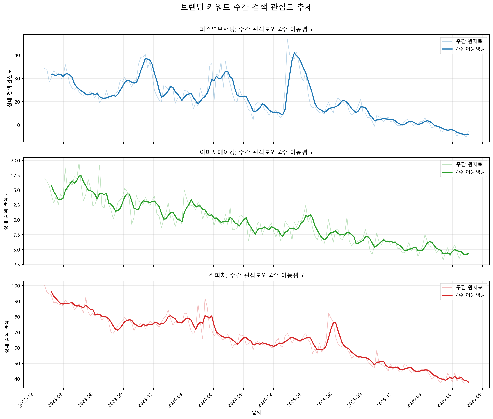
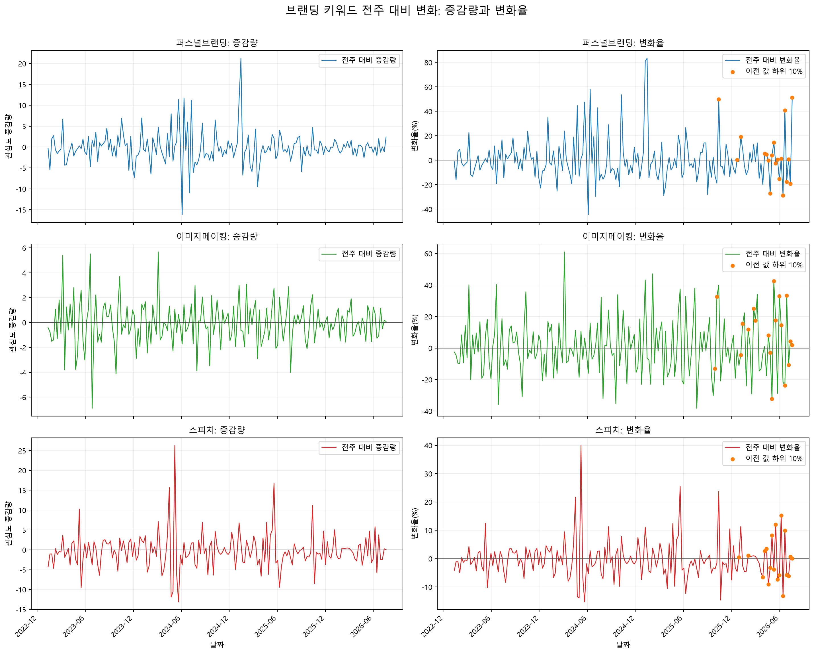
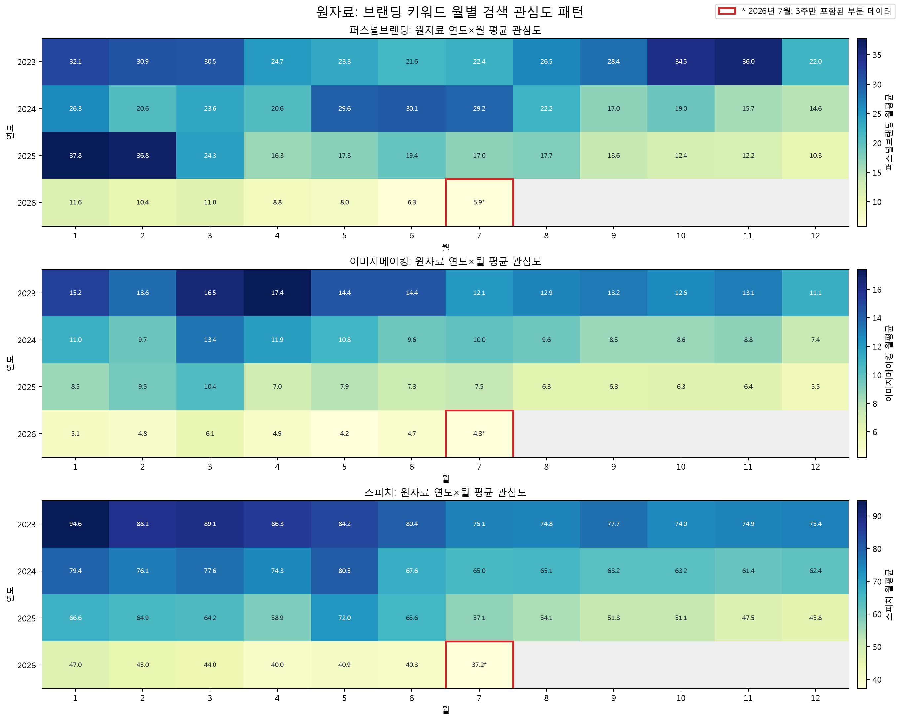
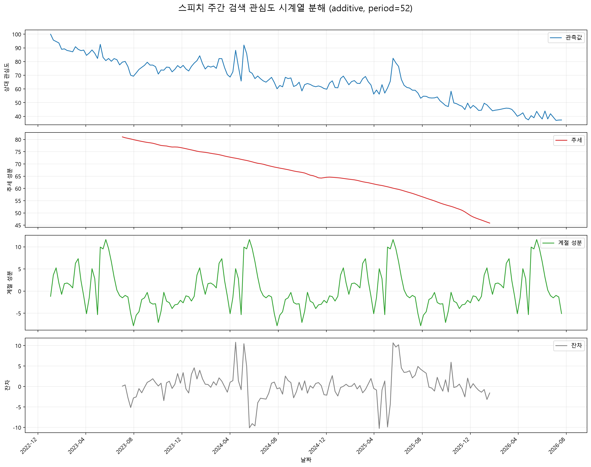

# 브랜딩 관련 검색 관심도 시계열 분석 리포트

## 목차

1. 분석 주제와 선정 이유
2. 분석 질문
3. 데이터 출처, 분석 기간, 데이터 구조
4. 데이터 품질 검증, 처리 기준, 분석 방법
5. 시각화 결과와 그래프별 해석
6. 시계열 분해 결과와 해석
7. 수치적 근거가 포함된 인사이트
8. Streamlit 대시보드 구현 결과
9. 결론
10. 분석의 한계
11. AI 사용 작업과 검증 방법
12. 실행 방법과 재현성

## 1. 분석 주제와 선정 이유

이 프로젝트는 네이버 데이터랩 검색어 트렌드에서 제공한 `퍼스널브랜딩`, `이미지메이킹`, `스피치`의 상대적 검색 관심도를 시계열로 분석한다.

- 분석 기간: 2023-01-02 ~ 2026-07-20
- 데이터 단위: 주간
- 전체 시점: 186개
- 키워드별 관측값: 186개

분석 목적은 감에 의존해 브랜딩 콘텐츠의 주제와 제작 시점을 정하는 대신, 검색 관심도의 장기 흐름, 큰 변화가 발생한 시점, 반복되는 월별 패턴을 근거로 콘텐츠 운영 방향을 판단하는 것이다.

## 2. 분석 질문

1. 세 키워드의 검색 관심도는 장기적으로 어떻게 변화했는가?
2. 관심도가 크게 움직인 시점은 언제인가?
3. 월이나 시기에 따라 반복되는 관심 패턴이 있는가?
4. 시기별로 세 키워드의 상대적 우선순위는 어떻게 변화했는가?

## 3. 데이터 출처, 분석 기간, 데이터 구조

- 출처: 네이버 데이터랩 검색어 트렌드
- 실제 데이터 기간: 2023-01-02 ~ 2026-07-20
- 주기: 매주 월요일을 기준으로 한 7일 간격의 주간 데이터
- 관측값: 키워드별 186개, 전체 수치 관측값 558개
- 결측치: 날짜와 세 키워드 모두 0개
- 중복 날짜: 0개

원본 엑셀의 실제 헤더는 `날짜`, `퍼스널브랜딩`, `날짜`, `이미지메이킹`, `날짜`, `스피치` 순서이다. 세 날짜 열이 186개 행에서 모두 동일한 것을 확인한 후 날짜 열 하나로 통합했다.

원본의 날짜와 관심도 값은 문자열로 저장되어 있었다. 날짜는 `datetime` 자료형으로, 세 키워드의 관심도 값은 `float` 숫자형으로 변환했다. 변환 후 새로 발생한 결측치는 없었다.

네이버 데이터랩의 관심도 값은 실제 검색 건수가 아니라 동일한 조회 조건 안에서 비교하는 상대적 검색 관심도 지표다. 따라서 이 보고서의 값은 검색량 몇 건을 의미하지 않으며, 서로 다른 조회 조건이나 별도 추출 자료의 값과 직접 비교하지 않는다.

## 4. 데이터 품질 검증, 처리 기준, 분석 방법

### 날짜 및 숫자형 변환

날짜를 `datetime`으로 변환하면 날짜순 정렬, 주간 간격 확인, 연도와 월 추출이 가능하다. 관심도 문자열은 계산 가능한 숫자형으로 변환했다. 변환이 실패하면 결측값이 생기도록 설정한 뒤, 실제 실패가 0개인지 확인했다.

### 4주 이동평균

4주 이동평균은 현재 주와 직전 3주의 관심도 평균이다. 매주 나타나는 단기 변동을 완화하여 약 한 달 동안의 흐름을 보기 위해 사용했다. 네 개의 값이 모이지 않은 첫 3주는 이동평균을 계산하지 않았다.

### 전주 대비 증감량과 변화율

- 전주 대비 증감량 = 이번 주 관심도 - 이전 주 관심도
- 전주 대비 변화율(%) = 전주 대비 증감량 / 이전 주 관심도 × 100

증감량은 관심도가 실제 지표상 얼마나 움직였는지 보여주고, 변화율은 이전 주에 비해 얼마나 빠르게 변했는지 보여준다. 이전 값이 작으면 변화율이 크게 보일 수 있으므로, 최대 증가와 최대 감소는 변화율이 아니라 증감량을 기준으로 선정했다. 변화율은 보조 지표로 함께 확인했다.

### 월별 평균

날짜에서 연도와 월을 추출하고 각 연도·월에 속한 주간 관심도의 평균을 계산했다. 월마다 포함되는 월요일 수가 다르므로 합계가 아닌 평균으로 비교했다.

2026년 7월에는 7월 6일, 13일, 20일의 3주만 포함되어 있다. 이 값은 히트맵에 부분 데이터로 표시했으며, 완전한 월과 동일하게 해석하지 않았다. 반복 월 분석은 12개월이 모두 있는 2023~2025년만 사용했다. 각 연도의 월평균 상위 3개월을 구한 뒤, 같은 달이 3개 연도 중 2회 이상 포함되면 반복 고관심 후보 월로 분류했다.

### 결측치·중복·이상치 검증 및 처리 기준

#### 관찰된 사실(Fact)

- 결측치 0개, 중복 날짜 0개다.
- 세 키워드의 날짜 열은 186개 행에서 모두 일치한다.
- 모든 관측 날짜는 월요일이고 인접 관측 간격은 7일이다.
- 세 키워드의 값은 모두 숫자형 변환에 성공했고 0~100 범위 안에 있다.
- 분석에 사용한 행은 186개이며, 키워드별 값을 합한 수치 관측은 558개다.

#### 처리 기준

- 결측치와 중복이 없으므로 대체, 보간 또는 행 삭제를 수행하지 않았다.
- 네이버 데이터랩 지수는 조회 조건 안에서 정규화된 상대 지표이므로 100 또는 급격한 변화가 곧 오류라는 뜻은 아니다. 단순 임계값으로 극단값을 제거하지 않고 원자료를 유지한 채 전주 대비 증감량·변화율과 시계열 문맥을 함께 확인했다.
- 이전 값이 0이면 변화율을 계산하지 않는 기준을 적용했다. 이번 데이터에는 분석을 방해하는 0 분모나 비수치 값이 없었다.
- 급등락과 큰 잔차는 삭제 대상이 아니라 추가 확인 대상으로 기록했다. 외부 사건과의 인과관계는 이 데이터만으로 검증하지 않았으므로 사실로 단정하지 않았다.

### 시계열 분석 기법과 적용 이유

- **4주 이동평균:** 주간 잡음을 완화하고 약 한 달 단위의 방향과 키워드 우선순위를 비교하기 위해 적용했다.
- **전주 대비 증감량·변화율:** 관심도가 크게 움직인 시점을 찾고, 지표상 이동 폭과 이전 주 대비 변화 속도를 구분하기 위해 적용했다.
- **연도·월별 평균과 반복 상위 월:** 월마다 포함되는 주 수 차이를 보정하고, 완전연도에서 반복되는 시기 후보를 찾기 위해 적용했다.
- **가법 시계열 분해:** 관측값을 추세·계절·잔차로 나누어 장기 방향과 약 1년 주기의 반복 패턴을 분리하기 위해 적용했다. 주간 데이터이므로 탐색 주기를 52로 설정했다.

## 5. 시각화 결과와 그래프별 해석

### 5.1 주간 관심도와 4주 이동평균



#### 관찰된 사실(Fact)

| 키워드 | 전체 평균 | 최솟값 | 최댓값 | 최댓값 발생 주 |
|---|---:|---:|---:|---|
| 퍼스널브랜딩 | 20.93060 | 4.69745 | 46.75557 | 2025-01-13 |
| 이미지메이킹 | 9.53370 | 3.18471 | 19.62579 | 2023-04-17 |
| 스피치 | 65.38657 | 37.04219 | 100.00000 | 2023-01-02 |

- 첫 4주 이동평균이 계산된 2023-01-23의 1순위는 스피치였다.
- 이후 전체 분석 기간 동안 4주 이동평균 1순위 변경은 0회였다.
- 세 키워드 쌍 사이의 4주 이동평균 교차도 0회였다.
- 따라서 동일한 데이터랩 조회 조건에서 스피치의 4주 이동평균이 전체 기간 동안 가장 높았다.

#### 해석·가설(Hypothesis)

이 데이터 범위에서는 스피치가 세 주제 중 비교적 지속적인 관심을 받은 주제일 가능성이 있다. 다만 이 순위는 동일한 조회 조건에서 산출된 상대 관심도 비교이며, 실제 검색 건수나 콘텐츠 성과의 절대적 우위를 뜻하지 않는다.

### 5.2 전주 대비 변화 분석



#### 관찰된 사실(Fact)

| 키워드 | 구분 | 발생 주 | 이전 값 | 현재 값 | 증감량 | 변화율 |
|---|---|---|---:|---:|---:|---:|
| 퍼스널브랜딩 | 최대 증가 | 2025-01-13 | 25.49761 | 46.75557 | 21.25796 | 83.37236% |
| 퍼스널브랜딩 | 최대 감소 | 2024-06-03 | 36.38535 | 20.20302 | -16.18233 | -44.47485% |
| 이미지메이킹 | 최대 증가 | 2024-03-04 | 9.29538 | 14.96815 | 5.67277 | 61.02784% |
| 이미지메이킹 | 최대 감소 | 2023-06-26 | 19.16799 | 12.28105 | -6.88694 | -35.92938% |
| 스피치 | 최대 증가 | 2024-05-06 | 65.78423 | 92.05812 | 26.27389 | 39.93950% |
| 스피치 | 최대 감소 | 2024-05-20 | 85.82802 | 72.71098 | -13.11704 | -15.28293% |

- 가장 큰 증가와 감소 시점은 키워드마다 서로 달랐다.
- 변화율이 가장 커 보이는 시점과 관심도 증감량이 가장 큰 시점은 같지 않을 수 있으므로, 두 지표를 함께 확인해야 한다.
- 위 표는 원인을 설명하지 않으며, 데이터에서 확인된 전주 대비 변화만 나타낸다.

#### 해석·가설(Hypothesis)

퍼스널브랜딩은 2025-01-13에 21.25796포인트(83.37236%), 스피치는 2024-05-06에 26.27389포인트(39.93950%) 상승했다. 이 시점들은 캠페인·미디어 노출·계절 요인과 연결될 가능성이 있지만, 본 데이터만으로 원인을 확인할 수 없으므로 콘텐츠 기획에서는 ‘추가 확인이 필요한 주목 시점’으로만 사용한다.

### 5.3 연도별 월평균 관심도



#### 관찰된 사실(Fact)

2023~2025년 각각의 월평균 상위 3개월에 같은 달이 2회 이상 포함된 결과는 다음과 같다.

| 키워드 | 반복 고관심 후보 월 | 상위 3개월 포함 횟수 |
|---|---|---|
| 퍼스널브랜딩 | 1월 | 3개 연도 중 2회 |
| 이미지메이킹 | 1월, 3월, 4월 | 각각 3회, 3회, 2회 |
| 스피치 | 1월, 3월, 5월 | 각각 3회, 2회, 2회 |

- 이미지메이킹의 1월과 3월은 2023~2025년 세 연도 모두에서 해당 연도의 상위 3개월에 포함됐다.
- 스피치의 1월도 세 연도 모두에서 상위 3개월에 포함됐다.
- 퍼스널브랜딩은 1월이 3개 연도 중 2회 상위 3개월에 포함됐다.
- 이는 3개 완전 연도에서 확인한 반복 후보이며, 장기적인 계절성이 확정됐다는 의미는 아니다.
- 2026년 7월 월평균은 퍼스널브랜딩 5.87181, 이미지메이킹 4.26619, 스피치 37.22797이지만 3주만 포함된 부분 데이터이므로 반복 월 판정에서 제외했다.

#### 해석·가설(Hypothesis)

세 키워드 모두에서 1월이 반복 상위 월 후보로 나타난 사실은 연초 계획 수립이나 자기계발 수요와 관련 있을 수 있다. 그러나 이 원인은 검색 관심도 시계열만으로 확인되지 않았으며, 2026년 7월처럼 일부 주만 포함된 월은 완전한 월과 직접 비교하지 않았다.

## 6. 시계열 분해 결과와 해석

스피치 주간 관심도만 `DatetimeIndex`로 변환하고 `W-MON` 빈도를 명시한 뒤, `seasonal_decompose`의 가법 모형(`model="additive"`)으로 관측값, 추세, 계절 성분, 잔차를 분리했다. `period=52`는 주간 자료에서 연간 유사 주기를 탐색하기 위한 가정이며, 계절성이 존재한다는 결론을 미리 전제하지 않는다. 추세 외삽은 사용하지 않아 기본 경계 결측값을 유지했다.



### Fact

- 스피치 자료는 2023-01-02부터 2026-07-20까지 결측 주 없이 이어지는 `W-MON` 빈도의 186개 관측값이다.
- 유효한 추세 성분은 134개이며 기간은 2023-07-03부터 2026-01-19까지다. 52개 경계 값은 기본 설정에 따라 결측값으로 남았다.
- 유효 추세의 평균은 65.95827이고, 최근 유효 추세 값은 45.85527이다.
- 최근 추세 방향 판정에 사용한 직전 4주 평균은 48.17280, 마지막 4주 평균은 46.46896으로 계산되어 `하락`으로 분류됐다.
- 계절 성분의 최댓값은 11.64107이며 첫 대표 날짜는 2023-05-22, 52주 주기 내 위치는 21주차다. 같은 최댓값은 2024-05-20, 2025-05-19, 2026-05-18에도 계산됐다.
- 계절 성분의 최솟값은 -7.82744이며 첫 대표 날짜는 2023-07-31, 52주 주기 내 위치는 31주차다. 같은 최솟값은 2024-07-29, 2025-07-28에도 계산됐다.
- 잔차 절대값이 가장 큰 날짜는 2024-04-15이며, 해당 잔차 값은 10.82102다.
- 위 요약값은 향후 AI 비서가 추세와 변동을 설명할 때 사용할 수 있는 정보 후보로 계산했으며, 현재 분석에는 미션 2의 AI 비서 코드를 포함하지 않았다.

### Interpretation (Hypothesis)

- 마지막 유효 4주 추세 평균이 직전 4주보다 낮다는 결과는 해당 유효 구간 말미에 스피치 관심도의 기초 흐름이 낮아졌을 가능성을 보여준다. 다만 최근 유효 추세 날짜가 전체 데이터 종료일보다 이른 2026-01-19이므로, 이를 2026-07-20 현재의 추세라고 해석해서는 안 된다.
- 52주 가정 아래 계산된 계절 성분의 고점·저점 위치는 비슷한 시기의 콘텐츠 주제 후보를 정하는 탐색 단서가 될 가능성이 있다. 실제 반복 계절성인지 판단하려면 더 긴 기간과 추가 검증이 필요하다.
- 큰 잔차는 추세와 가정된 계절 성분으로 설명되지 않은 움직임을 뜻한다. 그 원인은 이 검색 트렌드 데이터만으로 확인할 수 없으므로 외부 자료와 함께 검토해야 한다.

### Limitation

- 전체 186주는 52주 주기를 약 3.6회 포함할 뿐이어서 계절 성분의 장기 안정성을 판단하기에는 반복 횟수가 적다.
- 52주는 달력상의 1년과 완전히 일치하지 않으며, `seasonal_decompose`는 지정한 주기가 통계적으로 유의한지 검정하지 않는 단순 분해 방법이다.
- 추세 외삽을 사용하지 않아 양쪽 경계의 추세와 잔차를 해석할 수 없다.
- 네이버 데이터랩 값은 상대적 관심도이므로 분해 성분도 실제 검색 건수가 아니라 해당 상대 지표를 나눈 결과다.

## 7. 수치적 근거가 포함된 인사이트

### 인사이트 1

- **관찰(Fact):** 4주 이동평균 기준으로 스피치가 전체 기간 동안 1순위였으며, 1순위 변경과 키워드 간 이동평균 교차는 모두 0회였다.
- **해석(Hypothesis):** 동일한 비교 조건의 세 키워드 중에서는 스피치가 비교적 안정적인 기본 관심 주제일 가능성이 있다. 다만 상대 관심도가 실제 콘텐츠 수요나 성과를 그대로 의미하는지는 추가 확인이 필요하다.
- **활용(Action):** 스피치 콘텐츠는 특정 시기에만 제작하기보다 연중 유지하는 기본 콘텐츠 축으로 운영하고, 실제 조회수와 전환 성과를 함께 기록한다.

### 인사이트 2

- **관찰(Fact):** 2023~2025년 기준 이미지메이킹의 1월·3월과 스피치의 1월은 세 연도 모두에서 연도별 월평균 상위 3개월에 포함됐다. 이미지메이킹 4월, 스피치 3월·5월, 퍼스널브랜딩 1월도 2개 연도에서 반복됐다.
- **해석(Hypothesis):** 이 달들에는 해당 주제의 관심이 다시 높아질 가능성이 있다. 데이터 기간이 3개 완전 연도뿐이므로 동일 패턴이 계속될지는 추가 연도 자료로 확인해야 한다.
- **활용(Action):** 반복 후보 월 직전에 관련 콘텐츠를 준비하되, 발행 후 실제 조회수와 반응을 비교하여 다음 연도의 일정에 반영한다.

### 인사이트 3

- **관찰(Fact):** 최대 전주 대비 증가 주는 퍼스널브랜딩 2025-01-13, 이미지메이킹 2024-03-04, 스피치 2024-05-06으로 서로 달랐다. 최대 증감량은 각각 21.25796, 5.67277, 26.27389였다.
- **해석(Hypothesis):** 세 키워드가 같은 시점이 아니라 각기 다른 시점에 단기 관심을 받을 가능성이 있다. 단, 이 데이터만으로 변화의 외부 원인은 확인할 수 없다.
- **활용(Action):** 주간 증감량을 정기적으로 확인해 키워드별 급변에 대응하고, 일회성 변화인지 확인하기 위해 이후 4주 이동평균도 함께 본다.

### 인사이트 4

- **관찰(Fact):** 2026년 7월은 세 주의 관측값만 포함된 부분 데이터다.
- **해석(Hypothesis):** 부분월 평균은 남은 주의 값에 따라 달라질 가능성이 있으므로 완전한 월과 직접 비교하면 판단이 달라질 수 있다.
- **활용(Action):** 2026년 7월은 참고값으로만 표시하고, 완전한 월이 확보된 뒤 월별 콘텐츠 일정 판단에 사용한다.

## 8. Streamlit 대시보드 구현 결과

분석 결과를 대화형으로 탐색할 수 있도록 `app.py`와 `dashboard_data.py`를 사용한 Streamlit 대시보드를 구현했다. 원본 Excel은 읽기 전용으로 불러오며, 노트북에서 사용한 컬럼 정규화·데이터 검증·4주 이동평균 계산을 재사용한다.

### 구현 기능

- 분석 시작일과 종료일 선택
- `퍼스널브랜딩`, `이미지메이킹`, `스피치` 키워드 다중 선택
- 선택 조건에 따른 상대 검색 관심도와 4주 이동평균 그래프 갱신
- 관측 수, 평균, 표준편차, 최솟값, 중앙값, 최댓값 통계표 갱신
- 현재 필터 결과만 UTF-8 BOM CSV로 다운로드
- `.streamlit/config.toml` 기반 다크 테마
- 화면에서 지수를 실제 검색량이 아닌 **상대 검색 관심도 지수**로 명시

### 대시보드 캡처

#### 기본 화면


- **관찰된 사실:** 전체 기간 2023-01-02~2026-07-20, 세 키워드, 186개 주간 관측 시점이 표시된다. 세 키워드의 원자료와 4주 이동평균을 같은 그래프에서 비교할 수 있다.

#### 필터 변경 화면


- **관찰된 사실:** 사이드바 입력 기간을 2025-01-01~2025-12-31로 좁히고 `퍼스널브랜딩`만 선택했다. 실제 주간 관측 범위는 2025-01-06~2025-12-29이고 관측 시점은 52개로 갱신됐다.
- **해석:** 사용자가 입력한 경계 안에 존재하는 월요일 관측값만 포함되므로 입력 날짜와 첫·마지막 실제 관측일이 다를 수 있다.

### 기간·키워드 변경 시나리오

1. 기본 화면에서는 2023-01-02~2026-07-20 전체 기간과 세 키워드를 선택하여 장기 흐름을 비교한다.
2. 캡처 예시처럼 2025년과 `퍼스널브랜딩`만 선택하면 관측 시점이 186개에서 52개로 바뀌고, 그래프, 통계표, 데이터 미리보기, CSV가 모두 같은 조건으로 함께 갱신된다.
3. 키워드를 모두 해제하면 분석을 진행하지 않고 선택 안내를 표시한다. 시작일은 종료일 이후로 선택할 수 없도록 제한했다.

### 로컬 검증 결과

- 데이터 로딩·필터·통계·CSV 처리를 다루는 단위 테스트 5개가 모두 통과했다.
- Streamlit 로컬 서버의 상태 확인 주소(`/_stcore/health`)가 HTTP 200을 반환하는 것을 확인했다.
- 기본 화면과 필터 변경 화면을 실제로 확인해 `images/dashboard/`에 두 장의 캡처로 저장했다.
- 외부 배포와 공개 URL 검증은 수행하지 않았다.

## 9. 결론

첫 번째 질문인 장기 변화에서는 4주 이동평균을 통해 단기 변동을 완화했다. 그 결과 동일한 비교 조건에서 스피치가 전체 기간 1순위였고, 1순위 변경과 키워드 간 이동평균 교차는 모두 없었다.

두 번째 질문인 큰 변화 시점에서는 키워드별 최대 증감 주가 서로 다르게 나타났다. 따라서 전체 브랜딩 주제를 한 번에 움직이는 방식보다 키워드별 주간 변화를 따로 확인하는 방식이 적절하다. 변화율은 이전 값이 작을 때 커질 수 있으므로 증감량과 함께 판단해야 한다.

세 번째 질문인 반복 패턴에서는 2023~2025년 기준으로 이미지메이킹의 1월·3월, 스피치의 1월이 세 연도 모두에서 상위 3개월에 포함됐다. 그 밖에도 이미지메이킹 4월, 스피치 3월·5월, 퍼스널브랜딩 1월이 두 연도에서 반복됐다. 이 결과는 반복 후보를 찾은 것이며 계절성을 확정한 것은 아니다.

네 번째 질문인 상대적 우선순위에서는 스피치가 안정적인 상위 주제로 확인됐다. 콘텐츠 기획에서는 스피치를 연중 유지하는 안정적 관심 주제로 활용하고, 퍼스널브랜딩과 이미지메이킹은 반복 후보 월과 주간 급변 시점을 관찰하는 시기성 주제로 운영할 수 있다. 이 구분은 검색 관심도에 기반한 운영 가설이며, 실제 콘텐츠 성과 데이터로 검증해야 한다.

## 10. 분석의 한계

- 네이버 데이터랩 수치는 실제 검색량이 아니라 조회 조건 안에서 비교하는 상대값이다.
- 검색 관심도의 변화만으로 변화가 발생한 원인을 확정할 수 없다.
- 분석 기간이 약 3년 7개월이므로 장기적인 계절성을 확정하기에는 제한이 있다.
- 2026년 데이터는 7월 20일까지의 부분 연도이며, 특히 2026년 7월은 3주만 포함한다.
- 검색 관심도가 높더라도 실제 콘텐츠의 조회수, 체류 시간, 참여 또는 전환 성과가 높다고 단정할 수 없다.
- 향후에는 콘텐츠 클릭률, 조회수, 체류 시간, 문의나 구매 전환 데이터를 함께 분석할 필요가 있다.

## 11. AI 사용 작업과 검증 방법

### 사용 작업

- 데이터 구조 확인
- 분석 질문 설계
- 전처리 및 시각화 코드 작성
- 오류 원인 분석과 코드 수정
- 노트북 결과와 독립 계산의 교차검증
- Streamlit 대시보드 구현과 로컬 테스트
- 사실·해석·한계를 구분하는 보고서 문장 정리

### 사용 이유

- 분석 코드 작성 시간 절감
- 분석 방법 대안 탐색
- 오류 원인 파악
- 반복 계산과 문서 구조화 보조
- 누락된 평가 항목과 재현 절차 점검

### 검증 방법

- 원본 엑셀을 노트북 코드와 분리하여 다시 읽고 주요 결과를 독립적으로 재계산했다.
- 총 75개 비교 항목에서 노트북 저장 결과와 독립 계산 결과가 모두 일치했으며 불일치는 0개였다.
- 월별 43개 연도·월 행의 세 키워드 값, 총 129개 수치가 모두 일치했다.
- 2026-09-30에 기존 출력을 초기화한 노트북 복사본을 새 Python 커널에서 첫 셀부터 마지막 셀까지 다시 실행했다. 코드 셀 24개가 실행 순서 1~24로 모두 완료됐고 오류 출력은 0개였다. 원본 `analysis.ipynb`와 원본 데이터는 변경하지 않았다.
- 새 실행 출력과 REPORT.md의 핵심 수치 29개를 대조해 29개 모두 일치함을 확인했다. 이 항목에는 장기 추세 보완 수치인 유효 추세 평균 65.95827, 최근 유효 추세 값 45.85527, 직전 4주 추세 평균 48.17280, 마지막 4주 추세 평균 46.46896이 포함된다.
- 새 실행에서 그래프 4개가 모두 생성됐고, 기존 보고서 그래프와 데이터·축·범례·해석이 일치했다. 파일 해시는 1픽셀 크기와 안티앨리어싱 차이로 달랐지만 축소 시각 상관계수는 0.969699~0.995784였으며 분석 결과의 차이는 없었다.
- 생성된 이미지 4개의 존재 여부와 파일 크기·해상도를 확인했고, REPORT.md의 상대경로 링크가 실제 파일명과 일치하는지 검사했다.
- 원본 `data/datalab.xlsx`의 SHA-256이 실행 전후 모두 `F573C3738919F327323DCDEE0C257F3B93A9F1EFB07C5CDB369C6CE689956755`로 동일함을 확인했다.
- 최초 독립 검증에서는 XLSX 내부 범위 메타데이터가 실제 `A1:F193`이 아니라 `A1`로 기록되어 있어, `openpyxl` 읽기 전용 모드가 데이터 행을 0개로 인식했다. 이 때문에 기대값 186개와 실제값 0개가 달라 `AssertionError`가 발생했고, 빈 행 목록의 첫 행을 참조하면서 `IndexError`가 이어졌다.
- 검증 코드를 파일을 저장하지 않는 일반 메모리 읽기 방식으로 바꾸고 실제 8~193행과 A~F열을 읽도록 수정했다. 수정 후 독립 계산과 노트북 결과가 전부 일치함을 재확인했다.
- 대시보드 데이터 처리 단위 테스트 5개를 실행해 모두 통과했고, Streamlit 상태 확인 요청에서 HTTP 200을 확인했다.
- AI가 제안한 문장이나 코드를 그대로 사실로 채택하지 않고, 원본 데이터·저장된 노트북 출력·생성 이미지·실행 결과 중 하나 이상과 대조했다. 외부 원인 설명은 검증되지 않은 해석·가설로 표시했다.

## 12. 실행 방법과 재현성

### 환경 준비

Windows PowerShell에서 프로젝트 루트로 이동한 뒤 기존 가상환경과 의존성을 사용한다.

```powershell
cd C:\Users\pc\Desktop\branding-trend-analysis
.\.venv\Scripts\python.exe -m pip install -r requirements.txt
```

### 분석 노트북 실행

Jupyter가 설치되어 있지 않다면 가상환경에 설치한 후 노트북을 연다. 원본 Excel을 수정하지 않고 노트북 셀을 위에서 아래 순서로 실행한다.

```powershell
.\.venv\Scripts\python.exe -m pip install jupyter
.\.venv\Scripts\python.exe -m jupyter notebook analysis.ipynb
```

### Streamlit 대시보드 실행

```powershell
.\.venv\Scripts\python.exe -m streamlit run app.py
```

터미널에 표시되는 로컬 주소를 브라우저에서 열어 기간과 키워드를 선택한다. 다운로드 버튼은 현재 필터 결과를 새 CSV로 전달할 뿐 원본 Excel을 덮어쓰지 않는다.

### 자동 테스트

```powershell
.\.venv\Scripts\python.exe -m unittest discover -s tests -v
```

최종 확인 시 단위 테스트 5개가 통과했고 Streamlit 상태 확인이 HTTP 200을 반환했다. 재현 시에는 `data/datalab.xlsx`가 같은 위치에 있어야 하며, 원본 동일성은 아래 SHA-256으로 확인할 수 있다.

```text
F573C3738919F327323DCDEE0C257F3B93A9F1EFB07C5CDB369C6CE689956755
```

`requirements.txt`에 분석·시각화·대시보드 실행 의존성이 명시되어 있고, `.gitignore`는 가상환경과 `.env`·Streamlit 비밀 설정 파일이 Git에 포함되지 않도록 구성되어 있다.
